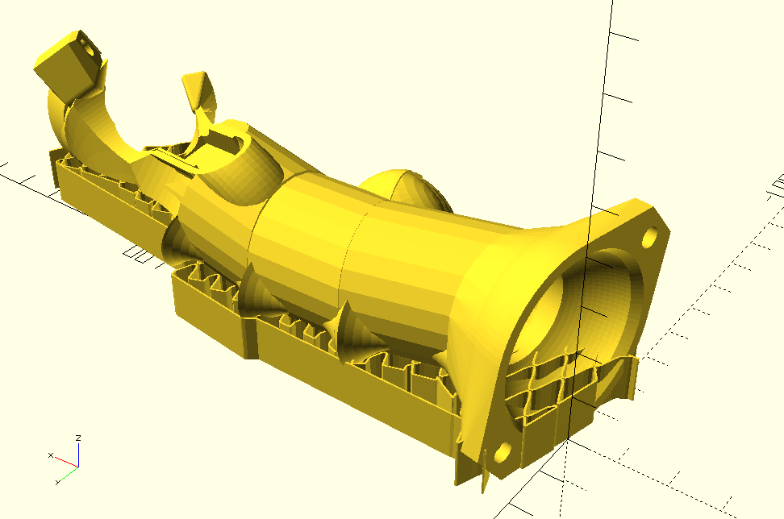
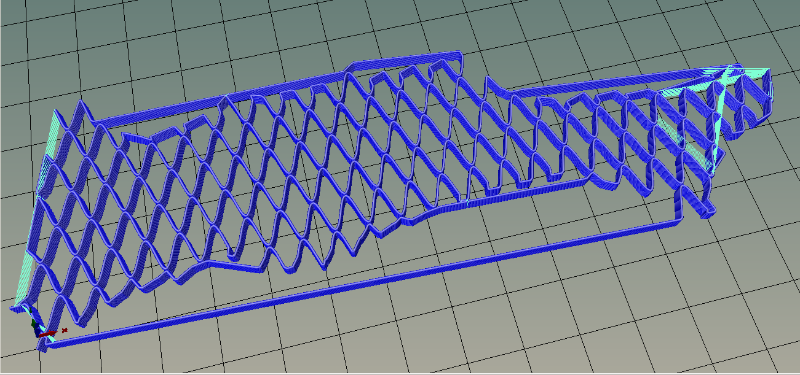
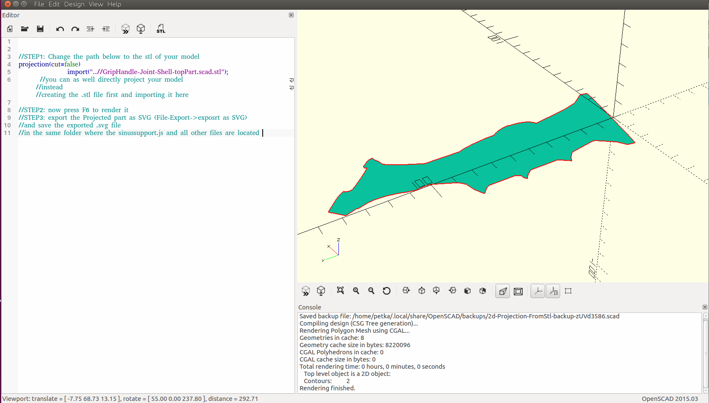

SinusSupport
Generates fast to print inbuilt support for your .stl or openscad model.
it uses continous sinus form to reduce deccelerations at sharp corners and reduce number of travel mooves.

*Quick and Dirty* thrown together Proggy. with some effort put into inbuilt instructions to figure out how to use it

*for illustrations and instructions on installation and usage open:
sinussupport.html*

written in javascript intended for use with OpenScad

### USE OF THIS PROGRAM (See MORE INSTRUCTIONS BELOW):  
It generates very fast printable support material with very few travel moves and deccelerations

<table style="border:1px solid black;">

<tbody>

<tr>

<th>from this:</th>

<th>to this:</th>

<th>having very few sharp corners(no deccelerations) and few travel moves like this:</th>

</tr>

<tr>

<td>  
</td>

<td>  
</td>

<td>  
</td>

</tr>

</tbody>

</table>

*   (INSTALLATION: download the full .zip file from github and extract it into a local folder, change to this new folder and open sinussupport.html from there).

*   step 1:create a 2D projection of your models .stl using openscad:  
    open 2d-Projection-FromStl.scad in scad and followthe instructions inside to create a 2d Projection of your model and save it as SVG  
    

*   step 2: In the Webbrowser (sinussupport.html) in the controls at the TOP-LEFT enter the name of the SVG you have just created in openscad

*   step 3: Click on Load SVG File and then on the "Get resulting Support Path scad code" which will appear if there were no errors  
    

*   step 4: save the resulting file under the suggested name "supportPathData.scad" in the same folder with the other files of this program.

*   step 5: open sinusSupport.scad in openscad and render it. here comes your support Material.  
    

*   step 6: edit the sinusSupport.scad or "include" it to UNION it with you original Model. (you could also subtract the hull of your Model from the support Material if you only need the support on bottom of the model, and not in its holes)  
    

*   Congratulations! You have an inbuilt fast printable sinusoidal Support

